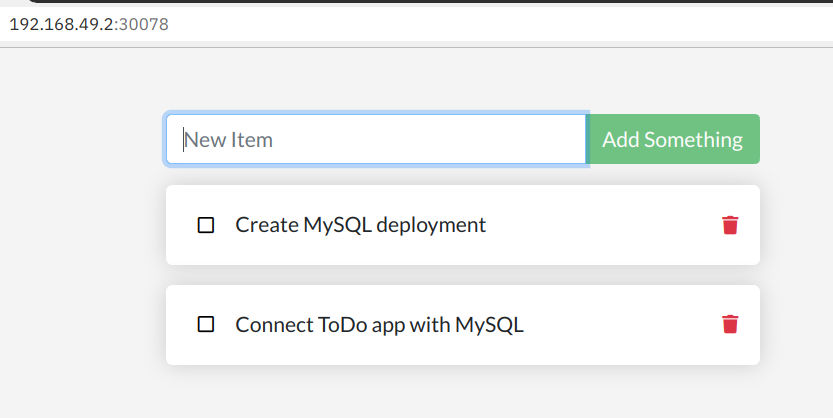

# Lab 2: Deploy ToDo app 

In the original Docker 101 workshop, this is the command to deploy the ToDo app stand-alone without database.

> **Do not run this command!** It is only here for reference!

```
docker run -dp 3000:3000 todo-app
```

* `todo-app` is the name of the container image that was created when following the Docker tutorial.
* `-p 3000:3000` maps Container port 3000 on local port 3000.

An equivalent Kubernetes deployment would look like this (file [deploy/todo-v1.yaml](../deploy/todo-v1.yaml)):

```
apiVersion: apps/v1
kind: Deployment
metadata:
  name: todo-app
  labels:
    app: todo
spec:
  replicas: 1
  selector:
    matchLabels:
      app: todo
  template:
    metadata:
      labels:
        app: todo
    spec:
      containers:
      - name: todo
        image: haraldu/todo-app:latest
        ports:
        - containerPort: 3000
```

* The ToDo app runs on port 3000.
* The `image:` tag points to my version of the todo-app container image on Docker Hub (`haraldu/todo-app:latest`).

=======================================================================================

**FYI** 

You can use your own "todo-app" container image, the one you created in the last hands-on (Docker 101 Workshop). There are two methods:

* **Method 1**

  If you already built the image in your local Docker, the following command will load this container image from your local Docker image store into Minikube's Docker image store:

  ```
  minikube image load todo-app:latest
  ```

* **Method 2**

  Build the image directly in the Minikube internal Docker environment. To do so, point your docker CLI to Minikube's Docker environment:

  ```
  eval $(minikube docker-env)
  ```

  To see if this worked, execute:

  ```
  docker images
  ```

  You should see all the container images that make up Kubernetes coming from the k8s.gcr.io repository.
  

  Now simply build your image using the usual `docker build` command. The docker CLI will transmit the build context into Minikube and Minikube's Docker will build the image and store it within Minikube.


To use the image from Minikube's own repository, you will have to modify **all** deployments for the "To-Do" app to use the local version of the image and change the ImagePull Policy to 'Never':

```
    spec:
      containers:
      - name: todo
        image: todo-app:latest
        imagePullPolicy: Never
```

With `imagePullPolicy: Never` Kubernetes will use your image locally stored in Minikube. The default however is `imagePullPolicy: Always` which will try to pull the image from Docker Hub which will fail because there is no such image on Docker Hub. The bad thing is that Kubernetes will only show a failed pod (container creation failed) and you will need to figure out why it fails ...

**/FYI**

=======================================================================================

## Deploy to Kubernetes


1. Apply the configuration:

    ```
    kubectl apply -f deploy/todo-v1.yaml
    ```

2. Check the result with

    ```
    kubectl get pod

    NAME                       READY   STATUS    RESTARTS   AGE
    todo-app-f8549b989-9cbdr   1/1     Running   0          44s
    ```

3. Check the logs with `stern` (or `podtail`)

    ```
    stern todo

    + todo-app-f8549b989-9cbdr › todo
    todo-app-f8549b989-9cbdr todo Using sqlite database at /etc/todos/todo.db
    todo-app-f8549b989-9cbdr todo Listening on port 3000
    ```

    This means the app started on port 3000 and is using sqlite.

## Accessing the ToDo app

Now how can you access the ToDo app?

#### Method 1: Port-Forwarding

You can use Kubernetes [port-forwarding](https://kubernetes.io/docs/tasks/access-application-cluster/port-forward-access-application-cluster/#forward-a-local-port-to-a-port-on-the-pod) to access a specific pod. It is for testing purposes, only.

1. Determine the name of the pod (the name of the pod will be different for you):

    ```
    kubectl get pod

    NAME                       READY   STATUS    RESTARTS   AGE
    todo-app-7cdfc755c-cq2g2   1/1     Running   0          3m10s
    ```

2. Use the pod's name to establish port-forwarding:

    ```
    kubectl port-forward todo-app-7cdfc755c-cq2g2 3000:3000
    ```

3. Open your browser on http://localhost:3000

> **What happens if you redeploy or restart the pod?** Your pod gets a new name. This means you have to determine the new name and change your port-forwarding command accordingly.

> What happens if your application is scaled up to **more than one pod**? You can only access one (1) pod at a time using port-forwarding.

Port-Forwarding may be OK to access an application for testing purposes. But if a Microservice A needs to access Microservice B, using the pod name that can change at any time is not a valid solution.

There must be a better way to do this! Indeed, it is:

#### Method 2. Kubernetes Service 

Kubernetes Pods are created and destroyed to match the desired state of your cluster. Pods are nonpermanent resources. If you use a Deployment to run your app, it can create and destroy Pods dynamically.

Each Pod gets its own distinct name and IP address, however in a Deployment, the set of Pods running in one moment in time could be different from the set of Pods running that application a moment later.

This leads to a problem: if some set of Pods (call them "backends") provides functionality to other Pods (call them "frontends") inside your cluster, how do the frontends find out and keep track of which name or IP address to connect to, so that the frontend can use the backend part of the workload?

Enter *Services*.
 
In Kubernetes, a Service is an abstraction which defines a logical set of Pods and a policy by which to access them. The set of Pods targeted by a Service is usually determined by a selector. The Service also provides a defined name.

This is the Service definition of the ToDo app (file [deploy/todo-service.yaml](../deploy/todo-service.yaml)):

```
apiVersion: v1
kind: Service
metadata:
  name: todo
spec:
  selector:
    app: todo
  type: NodePort
  ports:
    - protocol: TCP
      port: 3000
```

* The **selector** is `app: todo` and matches the **selector.matchLabels** in the Deployment configuration above.
* It exposes **port 3000** and is of type **NodePort** which allows us to access the service externally.

Apply with:

```
kubectl apply -f deploy/todo-service.yaml
```

Check with:

```
kubectl get service todo

NAME   TYPE       CLUSTER-IP       EXTERNAL-IP   PORT(S)          AGE
todo   NodePort   10.106.198.138   <none>        3000:32173/TCP   11s
```

Notice in the PORT(S) column the notation `3000:32173`. This means that the container port 3000 is mapped to NodePort 32173 on the external IP address of your Kubernetes cluster = Minikube.

Minikube provides an easy way to access the NodePort:

```
minikube service todo
```

This command will open your browser to the correct IP address and port. In addition, on Mac and Windows it will first create a tunnel into the VM running your Minikube cluster, giving you network access to it.

---


**Note:** If you (or Kubernetes) redeploy the app, all data is gone because it isn't persisted, the app uses a built-in sqlite database which resides inside the container, stores its data inside the container, which is destroyed on redeploy.

  

---

**Next Step:** [Create MySQL deployment](lab3.md) 
