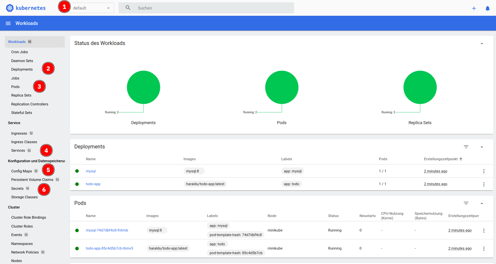

# Lab 8: Kubernetes Dashboard

So far you only worked with the `kubectl` CLI in text mode.

There is a graphical tool that comes with some Kubernetes distributions. In Minikube you can start it with the command:

```
minikube dashboard
```

It takes a moment to start, then it will open your browser:



Here you can easily:

1. Select a namespace 
2. Look at deployments
3. Pods
4. Services
5. Config Maps
6. Secrets

any many other things. 

# Clean up

If you no longer need your Minikube cluster you can simply delete it with:

```
minikube delete
```


**The End** 