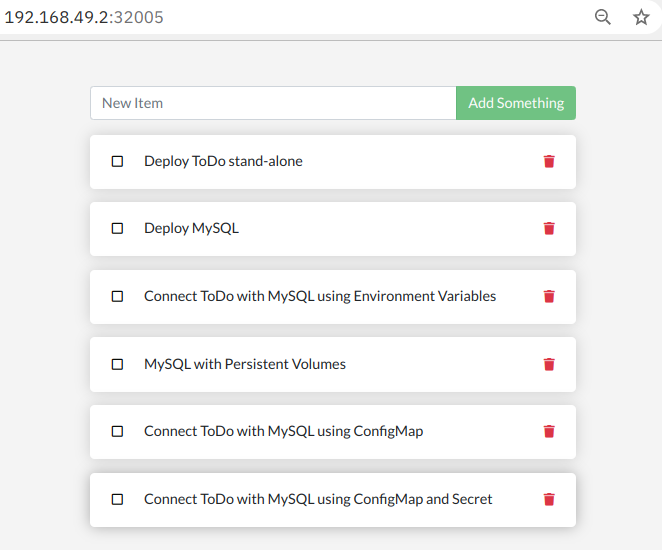

# Overview

This hands-on lab is building upon the [Docker 101](https://harald-u.github.io/docker-101/) workshop. 

In the Docker workshop, a Node.js based ToDo app is packaged as a Container image and then run on Docker, first stand-alone using a built-in database, and then as a multi-container app running MySQL as database in a second container.

We will use the information contained in the Docker commands of the Docker 101 workshop to create equivalent Kubernetes configurations. 

Building of Container Images is covered in the [Docker 101](https://harald-u.github.io/docker-101/docs/lab1#building-the-container-image). In this Kubernetes workshop we are using a Container image from my Docker Hub repository, but of course you can use your own.

The instructions in this lab are based on **Minikube**. They should work -- with some modifications -- with the Kubernetes that is part of Docker Desktop, with K3d, Kind, or any other Kubernetes distribution. Your mileage may vary ...

## Prerequisites

* [Docker](https://docs.docker.com/desktop/)
* [Minikube](https://minikube.sigs.k8s.io/docs/start/) Version 1.28.0 (using Kubernetes 1.25.3)
* [git](https://git-scm.com/downloads)
* [kubectl](https://kubernetes.io/docs/tasks/tools/install-kubectl/) Version 1.25.3
* [stern](https://github.com/stern/stern/releases) 

All executables must be copied to a location in your PATH.

> **bwLehrpool:** All prerequisites are already installed in the bwLehrpool image.

You may not know `stern`: it allows you to tail (follow) the logs of multiple pods on Kubernetes and multiple containers within the pod. It keeps displaying the logs when a pod is stopped and restarted. Each result is color coded for quicker debugging. 

## Labs

The ToDo app we are going to deploy is based on Node.js. It can run "stand-alone" and will use a built in SQLite database then. Or it can be used together with MySQL. During the labs we add more and more Kubernetes features.

- [Lab 1](docs/lab1.md) - Prepare the environment
- [Lab 2](docs/lab2.md) - Deploy ToDo stand-alone
- [Lab 3](docs/lab3.md) - Deploy MySQL
- [Lab 4](docs/lab4.md) - Connect ToDo with MySQL using Environment Variables
- [Lab 5](docs/lab5.md) - MySQL with Persistent Volumes
- [Lab 6](docs/lab6.md) - Connect ToDo with MySQL using ConfigMap
- [Lab 7](docs/lab7.md) - Connect ToDo with MySQL using ConfigMap and Secret